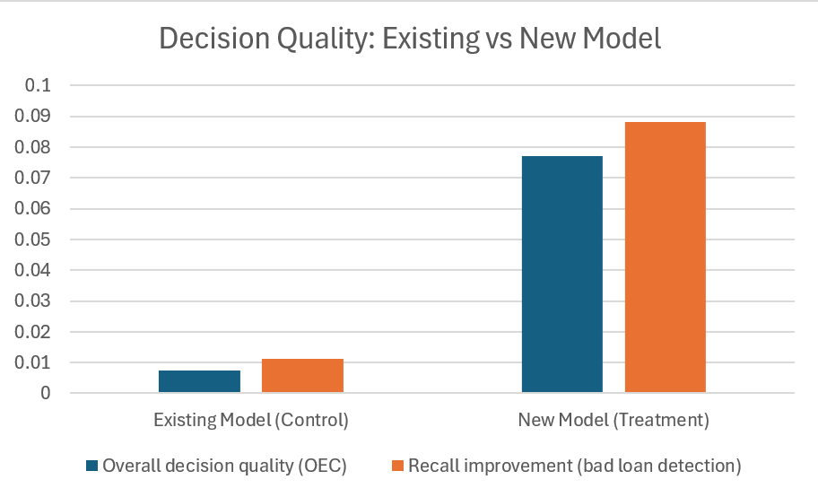

# Evaluating AI-Assisted Decision Quality

## 1. Problem Overview
Conducted a small-scale experiment to evaluate whether a **new computer model** improved loan officers’ decision-making compared to the **existing model**.

Both models were used to support human decisions. The key question was not whether the new model was more accurate, but whether it **meaningfully improved decision quality in practice**.

This creates a common real-world challenge: **how should AI-assisted decisions be evaluated when accuracy alone is insufficient?**

---

## 2. Experiment Context (Control vs Treatment)
The evaluation was based on an **A/B-style experiment** conducted over a limited time period.

- **Control group**: loan officers supported by the existing computer model
- **Treatment group**: loan officers supported by the new computer model

Both groups operated under the same conditions and decision environment, enabling a controlled comparison of outcomes.

---

## 3. Focus on Decision Quality
Rather than defining success in advance using a single metric, the evaluation was designed after observing the data, reflecting the realities of exploratory pilots.

Decision quality was assessed using multiple perspectives, including:
- Reduction in costly decision errors
- Improvements in recall for high-risk cases
- Overall decision quality scores combining multiple outcomes
- Practical implications for deployment

The objective was to determine whether the observed improvements justified further deployment or additional experimentation.

---

## 4. How the Evaluation Was Done

The experiment did not begin with a predefined success metric. Instead, decision quality was evaluated after observing the data, reflecting the exploratory nature of early-stage AI pilots.

Rather than focusing on predictive accuracy, outcomes were compared between the control (existing model) and treatment (new model) groups using:
- Reduction in costly decision errors
- Improved identification of high-risk cases
- An aggregate decision-quality score combining multiple outcomes

Given the limited time window and sample size, the analysis focused on **directional improvements** and **practical relevance** rather than strict statistical testing.

---

---

## 5. Results & Recommendation

### Key Findings
Compared to the existing model, the new model led to:
- Fewer high-severity decision errors
- Improved identification of high-risk cases
- Higher overall decision quality scores

Improvements were directionally consistent across metrics, even though the experiment was limited in duration and sample size.

---

### Visual Summary (Baseline vs New Model)

---

### Recommendation
**Proceed with cautious deployment.**
- Use the new model as decision support, not full automation
- Focus deployment on high-risk decision scenarios
- Continue monitoring outcomes before full-scale rollout

